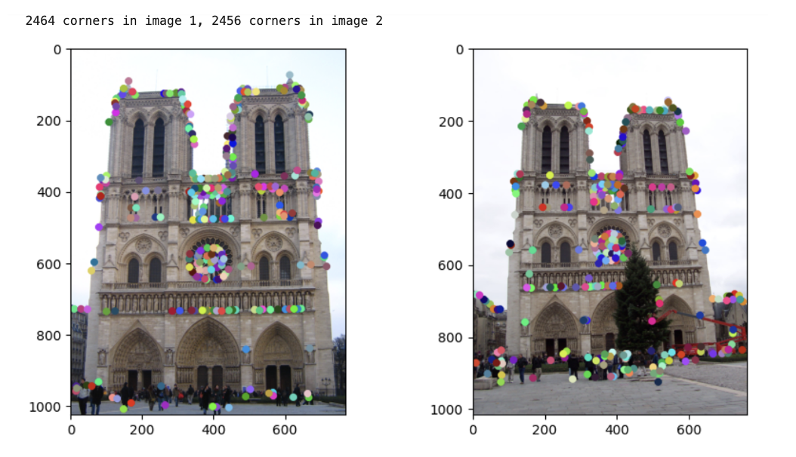
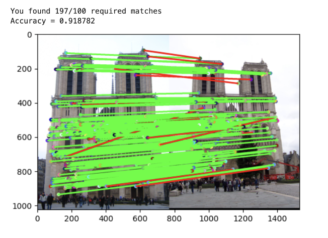
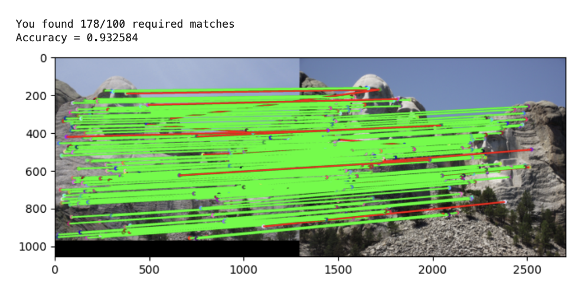

## Local Feature Matching Modules
### 1. Harris Corner Detection (part1_harris_corner.py)

This module implements the Harris Corner Detection algorithm, which is used to identify corners in an image. Corners are key points that are invariant to translation, rotation, and illumination changes, making them useful for image matching and object recognition tasks.

### 2. Patch Descriptor (part2_patch_descriptor.py)

The Patch Descriptor module extracts feature descriptors from image patches. Feature descriptors are vectors that describe the appearance of an image patch, which can be used for matching similar patches across different images.

### 3. Feature Matching (part3_feature_matching.py)

This module focuses on matching features between two images. By identifying correspondences between features in different images, this tool can be used for tasks such as image stitching, object recognition, and 3D reconstruction.

### 4. SIFT Descriptor (part4_sift_descriptor.py)

The SIFT Descriptor module implements the Scale-Invariant Feature Transform (SIFT) algorithm. SIFT is a popular feature extraction method that detects and describes local features in images, providing robustness to scale, rotation, and illumination changes.

