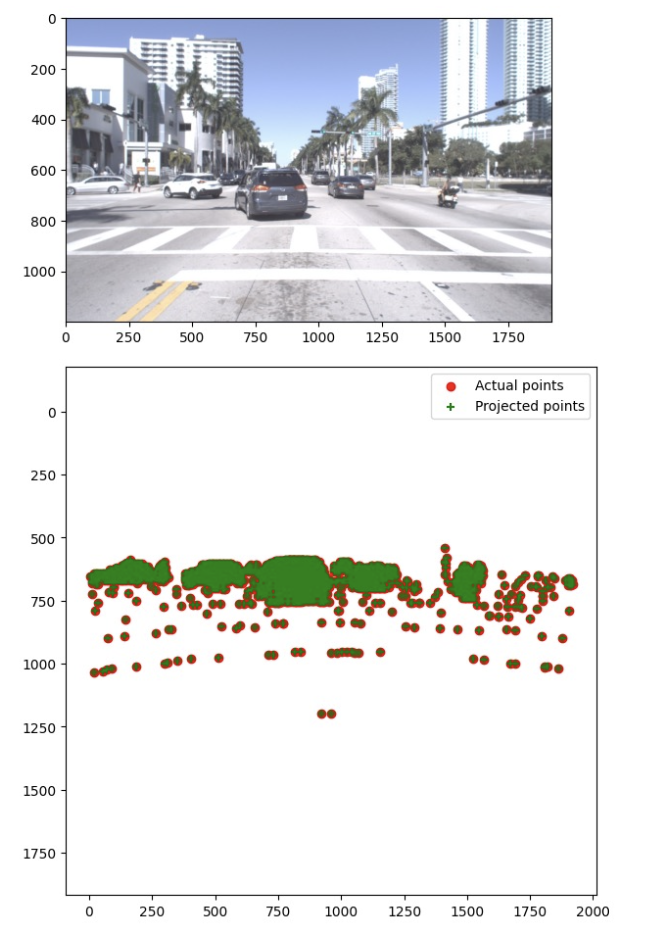
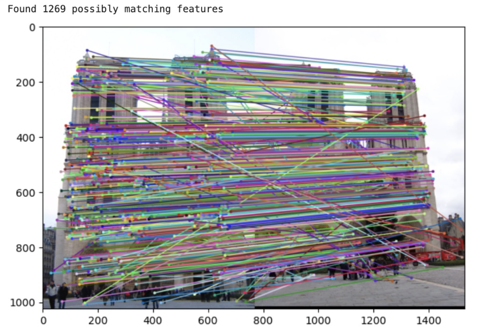
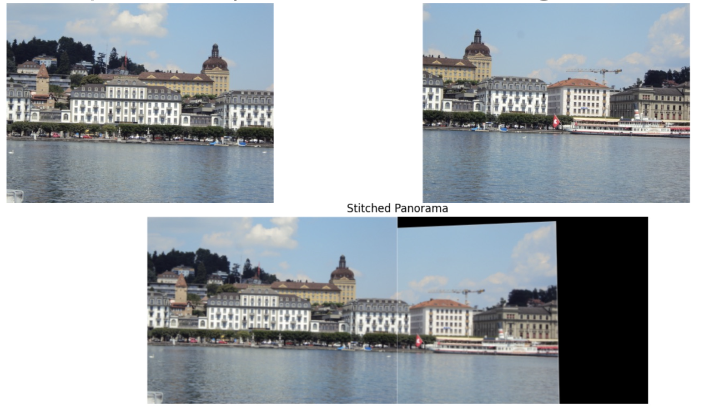

### 1. Projection Matrix (part1_projection_matrix.py)

This module computes the projection matrix, which is used to map 3D points in the world to 2D points in an image. The projection matrix is essential for tasks such as camera calibration, 3D reconstruction, and augmented reality.

### 2. Fundamental Matrix (part2_fundamental_matrix.py)

The Fundamental Matrix module calculates the fundamental matrix, a key concept in epipolar geometry. It relates corresponding points in stereo images and is used for tasks such as 3D reconstruction, camera calibration, and motion tracking.

### 3. RANSAC (part3_ransac.py)

This module implements the RANSAC (Random Sample Consensus) algorithm, which is used to estimate parameters of a mathematical model from a set of observed data containing outliers. RANSAC is commonly used in computer vision for robust model fitting, such as finding the fundamental matrix or homography between images.

### 4. Panorama Stitching (part6_panorama_stitching.py)

The Panorama Stitching module creates a panoramic image by stitching together multiple overlapping images. It uses feature matching and image blending techniques to create seamless panoramas, useful for applications in photography, virtual tours, and computer graphics.

